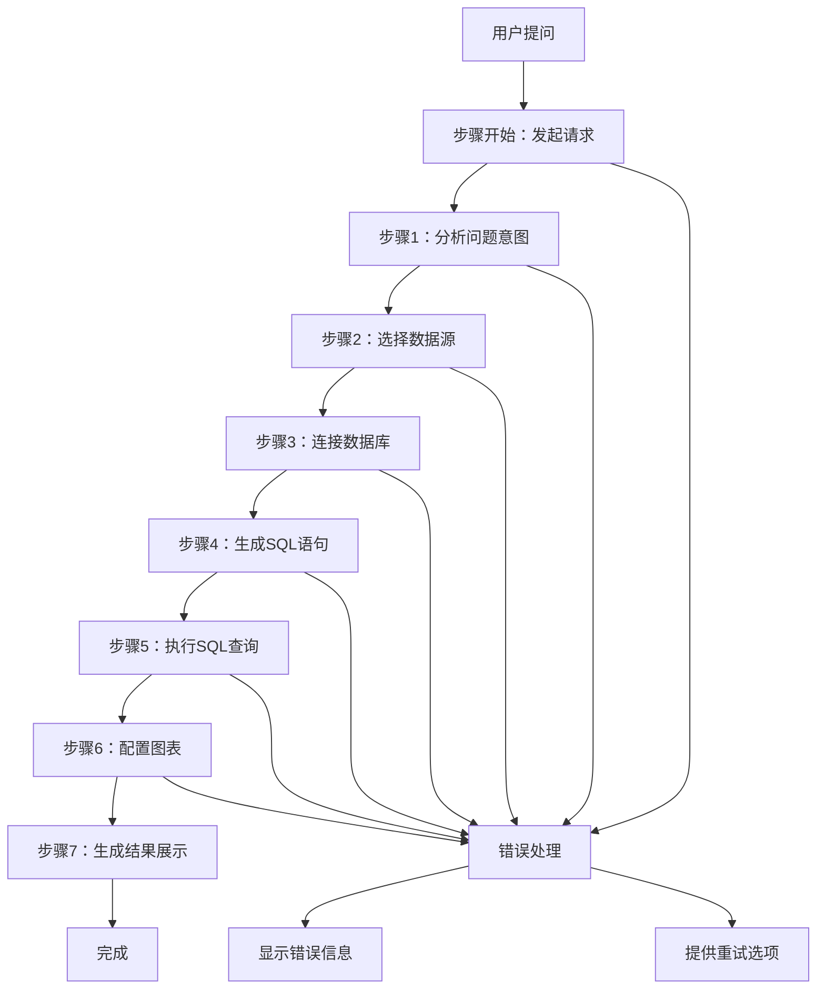

# SQLBot详细流式响应架构设计方案

## 设计目标

### 核心优化目标
1. **用户体验优化**：每一步都有清晰的进度提示，用户不再看到"转圈"等待
2. **详细步骤反馈**：包含起始语、数据库连接、SQL生成、查询执行、图表配置等详细过程
3. **样式统一**：与现有Element Plus UI样式保持一致
4. **错误处理**：每个步骤的异常都有清晰的错误提示

## 整体架构概览

### 数据流程设计



## 后端架构设计

### 1. 新的流式响应数据格式

#### 标准响应格式
```json
{
  "type": "step_progress",
  "step": {
    "id": "step_001",
    "name": "analyzing_question",
    "title": "分析问题意图",
    "description": "正在理解您的问题...",
    "status": "running", // pending | running | completed | error
    "progress": 30, // 0-100
    "startTime": "2025-10-28T03:56:00Z",
    "estimatedDuration": 2000, // 预估持续时间(毫秒)
    "metadata": {}
  },
  "timestamp": "2025-10-28T03:56:01Z"
}
```

#### 内容输出格式
```json
{
  "type": "content_stream",
  "content": {
    "text": "生成的SQL内容片段",
    "reasoning": "思考过程内容",
    "stepId": "step_004",
    "streamId": "stream_001"
  },
  "timestamp": "2025-10-28T03:56:01Z"
}
```

#### 步骤完成格式
```json
{
  "type": "step_completed",
  "step": {
    "id": "step_001",
    "name": "analyzing_question",
    "status": "completed",
    "result": {
      "summary": "问题分析完成",
      "output": "分析结果数据"
    },
    "duration": 1800, // 实际耗时(毫秒)
    "endTime": "2025-10-28T03:56:01.8Z"
  },
  "nextStep": {
    "id": "step_002",
    "name": "select_datasource",
    "title": "选择数据源"
  },
  "timestamp": "2025-10-28T03:56:01.8Z"
}
```

### 2. 后端API增强设计

#### 步骤定义
```python
class ProcessingStep:
    def __init__(self, step_id: str, name: str, title: str, description: str, estimated_duration: int = 0):
        self.step_id = step_id
        self.name = name
        self.title = title
        self.description = description
        self.estimated_duration = estimated_duration
        self.status = "pending"
        self.progress = 0
        self.start_time = None
        self.end_time = None
        self.metadata = {}
```

#### 增强的LLMService流式输出
```python
class EnhancedLLMService:
    async def stream_with_steps(self):
        # 步骤1：分析问题意图
        await self.step_manager.start_step("analyzing_question", "分析问题意图", "正在理解您的问题...")
        analysis_result = await self.analyze_question()
        await self.step_manager.complete_step("analyzing_question", analysis_result)
        
        # 步骤2：选择数据源
        await self.step_manager.start_step("select_datasource", "选择数据源", "正在选择最适合的数据源...")
        ds_result = await self.select_datasource()
        await self.step_manager.complete_step("select_datasource", ds_result)
        
        # 步骤3：连接数据库
        await self.step_manager.start_step("connect_db", "连接数据库", "正在建立数据库连接...")
        conn_result = await self.connect_database()
        await self.step_manager.complete_step("connect_db", conn_result)
        
        # 步骤4：生成SQL
        await self.step_manager.start_step("generate_sql", "生成SQL", "正在生成SQL查询语句...")
        sql_generator = self.generate_sql_with_progress()
        async for sql_chunk in sql_generator:
            yield self.format_sql_chunk(sql_chunk)
        sql_result = await self.finalize_sql()
        await self.step_manager.complete_step("generate_sql", sql_result)
        
        # 步骤5：执行查询
        await self.step_manager.start_step("execute_query", "执行查询", "正在执行SQL查询...")
        query_result = await self.execute_sql_with_progress()
        await self.step_manager.complete_step("execute_query", query_result)
        
        # 步骤6：配置图表
        if need_chart:
            await self.step_manager.start_step("configure_chart", "配置图表", "正在配置图表展示...")
            chart_config = await self.configure_chart()
            await self.step_manager.complete_step("configure_chart", chart_config)
        
        # 完成
        await self.step_manager.mark_all_completed()
```

## 前端架构设计

### 1. 进度显示组件架构

#### 步骤进度组件 (StepProgress.vue)
```vue
<template>
  <div class="step-progress-container">
    <!-- 总体进度 -->
    <el-card class="overall-progress" shadow="never">
      <div class="progress-header">
        <el-icon class="status-icon" :class="overallStatus">
          <component :is="statusIcon" />
        </el-icon>
        <span class="progress-title">{{ overallTitle }}</span>
        <el-progress 
          :percentage="overallProgress" 
          :status="overallProgress === 100 ? 'success' : 'normal'"
          :stroke-width="8"
        />
      </div>
      <div class="current-step" v-if="currentStep">
        <el-text class="current-step-title">{{ currentStep.title }}</el-text>
        <el-text class="current-step-desc">{{ currentStep.description }}</el-text>
        <div class="step-progress">
          <el-progress 
            :percentage="currentStep.progress" 
            :status="currentStep.status === 'error' ? 'exception' : 'normal'"
            :stroke-width="6"
          />
        </div>
      </div>
    </el-card>
    
    <!-- 详细步骤列表 -->
    <div class="step-list">
      <el-collapse v-model="expandedSteps" accordion>
        <el-collapse-item 
          v-for="step in steps" 
          :key="step.id" 
          :name="step.id"
        >
          <template #title>
            <div class="step-item" :class="step.status">
              <el-icon class="step-icon">
                <component :is="getStepIcon(step.status)" />
              </el-icon>
              <span class="step-title">{{ step.title }}</span>
              <el-tag 
                :type="getStepStatusType(step.status)" 
                size="small"
                class="step-tag"
              >
                {{ getStepStatusText(step.status) }}
              </el-tag>
            </div>
          </template>
          
          <div class="step-details">
            <el-text class="step-description">{{ step.description }}</el-text>
            
            <!-- 实时输出内容 -->
            <div v-if="step.output && step.output.length > 0" class="step-output">
              <div class="output-header">
                <el-icon><Document /></el-icon>
                <span>输出内容</span>
              </div>
              <div class="output-content">
                <pre v-for="(content, index) in step.output" :key="index">{{ content }}</pre>
              </div>
            </div>
            
            <!-- 错误信息 -->
            <el-alert 
              v-if="step.error" 
              :title="step.error.title" 
              :description="step.error.message"
              type="error" 
              show-icon
              :closable="false"
            />
          </div>
        </el-collapse-item>
      </el-collapse>
    </div>
    
    <!-- 控制按钮 -->
    <div class="progress-controls">
      <el-button @click="toggleDetails" :icon="DetailIcon">
        {{ showDetails ? '隐藏详情' : '显示详情' }}
      </el-button>
      <el-button @click="cancelProcess" :icon="CloseIcon" :disabled="isCompleted">
        取消
      </el-button>
      <el-button @click="retryFailed" :icon="RefreshIcon" :disabled="!hasFailedSteps">
        重试失败步骤
      </el-button>
    </div>
  </div>
</template>

<script setup lang="ts">
import { ref, computed } from 'vue'
import { 
  Loading, 
  Check, 
  Close, 
  Warning, 
  Document, 
  More, 
  Refresh, 
  ArrowRight 
} from '@element-plus/icons-vue'

interface Step {
  id: string
  name: string
  title: string
  description: string
  status: 'pending' | 'running' | 'completed' | 'error'
  progress: number
  startTime?: string
  endTime?: string
  estimatedDuration?: number
  output?: string[]
  error?: {
    title: string
    message: string
    code?: string
  }
  metadata?: Record<string, any>
}

const props = defineProps<{
  steps: Step[]
  overallProgress: number
  overallTitle: string
  isCompleted: boolean
}>()

const emit = defineEmits<{
  cancel: []
  retry: [stepId: string]
  toggleDetails: [show: boolean]
}>()

const expandedSteps = ref<string[]>([])
const showDetails = ref(true)

// 计算属性
const currentStep = computed(() => {
  return props.steps.find(step => step.status === 'running')
})

const overallStatus = computed(() => {
  if (props.isCompleted) return 'completed'
  if (props.steps.some(step => step.status === 'error')) return 'error'
  if (currentStep.value) return 'running'
  return 'pending'
})

const hasFailedSteps = computed(() => {
  return props.steps.some(step => step.status === 'error')
})

// 方法
const getStepIcon = (status: string) => {
  switch (status) {
    case 'pending': return Loading
    case 'running': return Loading
    case 'completed': return Check
    case 'error': return Close
    default: return Warning
  }
}

const getStepStatusType = (status: string) => {
  switch (status) {
    case 'pending': return 'info'
    case 'running': return 'primary'
    case 'completed': return 'success'
    case 'error': return 'danger'
    default: return 'info'
  }
}

const getStepStatusText = (status: string) => {
  switch (status) {
    case 'pending': return '等待中'
    case 'running': return '执行中'
    case 'completed': return '已完成'
    case 'error': return '失败'
    default: return '未知'
  }
}

const toggleDetails = () => {
  showDetails.value = !showDetails.value
  emit('toggleDetails', showDetails.value)
}

const cancelProcess = () => {
  emit('cancel')
}

const retryFailed = () => {
  const failedSteps = props.steps.filter(step => step.status === 'error')
  failedSteps.forEach(step => emit('retry', step.id))
}
</script>
```

### 2. 流式数据处理服务

#### 增强的流式处理器 (useEnhancedStreaming.ts)
```typescript
import { ref, reactive } from 'vue'
import type { Ref } from 'vue'

interface StreamingStep {
  id: string
  name: string
  title: string
  description: string
  status: 'pending' | 'running' | 'completed' | 'error'
  progress: number
  startTime?: string
  endTime?: string
  output: string[]
  error?: {
    title: string
    message: string
    code?: string
  }
  metadata: Record<string, any>
}

interface StreamingResponse {
  type: 'step_progress' | 'content_stream' | 'step_completed' | 'error' | 'final'
  step?: StreamingStep
  content?: {
    text: string
    reasoning?: string
    stepId: string
  }
  timestamp: string
  nextStep?: {
    id: string
    name: string
    title: string
  }
}

export function useEnhancedStreaming() {
  const steps = reactive<StreamingStep[]>([])
  const overallProgress = ref(0)
  const overallTitle = ref('准备开始')
  const isCompleted = ref(false)
  const currentStream: Ref<ReadableStream | null> = ref(null)
  const abortController = ref<AbortController | null>(null)

  // 初始化步骤
  const initializeSteps = (question: string) => {
    steps.splice(0, steps.length)
    
    const stepDefinitions = [
      { id: 'step_001', name: 'analyzing_question', title: '分析问题意图', description: '正在理解您的问题...' },
      { id: 'step_002', name: 'select_datasource', title: '选择数据源', description: '正在选择最适合的数据源...' },
      { id: 'step_003', name: 'connect_db', title: '连接数据库', description: '正在建立数据库连接...' },
      { id: 'step_004', name: 'generate_sql', title: '生成SQL', description: '正在生成SQL查询语句...' },
      { id: 'step_005', name: 'execute_query', title: '执行查询', description: '正在执行SQL查询...' },
      { id: 'step_006', name: 'configure_chart', title: '配置图表', description: '正在配置图表展示...', optional: true }
    ]

    stepDefinitions.forEach((stepDef, index) => {
      steps.push({
        id: stepDef.id,
        name: stepDef.name,
        title: stepDef.title,
        description: stepDef.description,
        status: 'pending',
        progress: 0,
        output: [],
        metadata: { optional: stepDef.optional || false }
      })
    })
  }

  // 处理流式响应
  const processStream = async (response: Response) => {
    if (!response.body) {
      throw new Error('No response body')
    }

    const reader = response.body.getReader()
    const decoder = new TextDecoder('utf-8')
    let buffer = ''

    while (true) {
      const { done, value } = await reader.read()
      if (done) break

      buffer += decoder.decode(value, { stream: true })
      const lines = buffer.split('\n\n')
      buffer = lines.pop() || '' // 保留不完整的行

      for (const line of lines) {
        if (!line.startsWith('data:')) continue
        
        try {
          const data = JSON.parse(line.slice(5)) as StreamingResponse
          await handleStreamingData(data)
        } catch (error) {
          console.error('Failed to parse streaming data:', error)
        }
      }
    }
  }

  // 处理具体的流式数据
  const handleStreamingData = async (data: StreamingResponse) => {
    switch (data.type) {
      case 'step_progress':
        if (data.step) {
          updateStepProgress(data.step)
        }
        break

      case 'content_stream':
        if (data.content && data.stepId) {
          addStepOutput(data.stepId, data.content.text, data.content.reasoning)
        }
        break

      case 'step_completed':
        if (data.step) {
          completeStep(data.step.id)
          if (data.nextStep) {
            prepareNextStep(data.nextStep.id)
          }
        }
        updateOverallProgress()
        break

      case 'error':
        handleError(data.step?.id, data.content?.text || 'Unknown error')
        break

      case 'final':
        isCompleted.value = true
        overallTitle.value = '处理完成'
        break
    }
  }

  // 更新步骤进度
  const updateStepProgress = (step: StreamingStep) => {
    const existingStep = steps.find(s => s.id === step.id)
    if (existingStep) {
      Object.assign(existingStep, step)
      if (step.status === 'running') {
        existingStep.startTime = step.startTime || new Date().toISOString()
      }
    }
  }

  // 添加步骤输出
  const addStepOutput = (stepId: string, text: string, reasoning?: string) => {
    const step = steps.find(s => s.id === stepId)
    if (step) {
      if (text) step.output.push(text)
      if (reasoning) {
        // 处理思考过程的显示
        step.metadata.thinking = step.metadata.thinking || []
        step.metadata.thinking.push(reasoning)
      }
    }
  }

  // 完成步骤
  const completeStep = (stepId: string) => {
    const step = steps.find(s => s.id === stepId)
    if (step) {
      step.status = 'completed'
      step.progress = 100
      step.endTime = new Date().toISOString()
    }
  }

  // 准备下一步
  const prepareNextStep = (nextStepId: string) => {
    const nextStep = steps.find(s => s.id === nextStepId)
    if (nextStep && nextStep.status === 'pending') {
      nextStep.status = 'running'
      nextStep.startTime = new Date().toISOString()
    }
  }

  // 处理错误
  const handleError = (stepId?: string, errorMessage?: string) => {
    if (stepId) {
      const step = steps.find(s => s.id === stepId)
      if (step) {
        step.status = 'error'
        step.error = {
          title: '步骤执行失败',
          message: errorMessage || 'Unknown error'
        }
      }
    }
    isCompleted.value = true
    overallTitle.value = '处理失败'
  }

  // 更新总体进度
  const updateOverallProgress = () => {
    const completedSteps = steps.filter(s => s.status === 'completed').length
    const totalSteps = steps.length
    overallProgress.value = Math.round((completedSteps / totalSteps) * 100)
    
    if (completedSteps === totalSteps) {
      isCompleted.value = true
      overallTitle.value = '处理完成'
    }
  }

  // 发起请求
  const startStreaming = async (question: string, options?: { chatId?: number }) => {
    abortController.value = new AbortController()
    initializeSteps(question)
    overallTitle.value = '开始处理'
    isCompleted.value = false

    try {
      const response = await fetch('/api/chat/enhanced-question', {
        method: 'POST',
        headers: {
          'Content-Type': 'application/json'
        },
        body: JSON.stringify({
          question,
          chat_id: options?.chatId,
          enhanced_streaming: true
        }),
        signal: abortController.value.signal
      })

      if (!response.ok) {
        throw new Error(`HTTP error! status: ${response.status}`)
      }

      await processStream(response)
    } catch (error) {
      handleError(undefined, error instanceof Error ? error.message : 'Network error')
    }
  }

  // 取消处理
  const cancelStreaming = () => {
    if (abortController.value) {
      abortController.value.abort()
    }
  }

  // 重试步骤
  const retryStep = async (stepId: string) => {
    const step = steps.find(s => s.id === stepId)
    if (step && step.status === 'error') {
      step.status = 'pending'
      step.error = undefined
      step.output = []
      
      // 这里可以发起特定步骤的重试请求
      // await retrySpecificStep(stepId)
    }
  }

  return {
    steps,
    overallProgress,
    overallTitle,
    isCompleted,
    startStreaming,
    cancelStreaming,
    retryStep
  }
}
```

### 3. 聊天界面集成

#### 增强的聊天消息组件
```vue
<template>
  <div class="enhanced-chat-message">
    <!-- 用户消息 -->
    <div v-if="message.role === 'user'" class="user-message">
      <div class="message-content">{{ message.content }}</div>
    </div>

    <!-- AI回复消息 -->
    <div v-else-if="message.role === 'assistant'" class="assistant-message">
      <div class="message-header">
        <el-avatar :size="32" :src="assistantAvatar" />
        <span class="assistant-name">{{ assistantName }}</span>
        <el-tag size="small" :type="getMessageStatusType()">
          {{ getMessageStatusText() }}
        </el-tag>
      </div>

      <!-- 步骤进度显示 -->
      <StepProgress
        v-if="message.streaming && hasSteps"
        :steps="streamingSteps"
        :overall-progress="overallProgress"
        :overall-title="overallTitle"
        :is-completed="isCompleted"
        @cancel="cancelStreaming"
        @retry="retryStep"
        @toggle-details="toggleDetails"
      />

      <!-- 最终结果 -->
      <div v-if="message.content && !message.streaming" class="message-content">
        <MdComponent :content="message.content" />
      </div>

      <!-- 控制按钮 -->
      <div v-if="message.streaming && isCompleted" class="message-controls">
        <el-button size="small" @click="regenerate" :icon="RefreshIcon">
          重新生成
        </el-button>
        <el-button size="small" @click="copyContent" :icon="CopyIcon">
          复制
        </el-button>
      </div>
    </div>
  </div>
</template>

<script setup lang="ts">
import { ref, computed } from 'vue'
import StepProgress from '@/components/StepProgress.vue'
import MdComponent from '@/views/chat/component/MdComponent.vue'
import { Refresh, Copy } from '@element-plus/icons-vue'
import { useEnhancedStreaming } from '@/composables/useEnhancedStreaming'

interface ChatMessage {
  id: string
  role: 'user' | 'assistant'
  content: string
  timestamp: string
  streaming?: boolean
  steps?: any[]
  error?: string
}

const props = defineProps<{
  message: ChatMessage
  assistantName?: string
  assistantAvatar?: string
}>()

const emit = defineEmits<{
  regenerate: [messageId: string]
  copy: [content: string]
}>()

const RefreshIcon = Refresh
const CopyIcon = Copy

// 使用增强的流式处理
const {
  steps: streamingSteps,
  overallProgress,
  overallTitle,
  isCompleted,
  startStreaming,
  cancelStreaming,
  retryStep
} = useEnhancedStreaming()

const hasSteps = computed(() => props.message.streaming && props.message.steps)

const getMessageStatusType = () => {
  if (props.message.error) return 'danger'
  if (props.message.streaming && !isCompleted.value) return 'primary'
  if (isCompleted.value) return 'success'
  return 'info'
}

const getMessageStatusText = () => {
  if (props.message.error) return '错误'
  if (props.message.streaming && !isCompleted.value) return '处理中'
  if (isCompleted.value) return '已完成'
  return '正常'
}

const regenerate = () => {
  emit('regenerate', props.message.id)
}

const copyContent = () => {
  emit('copy', props.message.content)
}

const toggleDetails = (show: boolean) => {
  // 控制详细信息的显示
  // 可以保存到本地存储或状态管理中
}
</script>
```

## 数据传输格式详细设计

### 1. 完整的SSE消息格式

```typescript
// 基础消息类型
type SSEEventType = 
  | 'step_start' 
  | 'step_progress' 
  | 'step_content' 
  | 'step_complete' 
  | 'step_error' 
  | 'final_complete'
  | 'stream_error'

interface SSEEvent {
  type: SSEEventType
  timestamp: string
  sequence: number // 序列号，确保顺序
  sessionId: string // 会话ID
}

// 步骤开始事件
interface StepStartEvent extends SSEEvent {
  type: 'step_start'
  step: {
    id: string
    name: string
    title: string
    description: string
    estimatedDuration?: number
    metadata?: Record<string, any>
  }
}

// 步骤进度事件
interface StepProgressEvent extends SSEEvent {
  type: 'step_progress'
  stepId: string
  progress: number // 0-100
  message?: string // 当前正在执行的操作
}

// 步骤内容流事件
interface StepContentEvent extends SSEEvent {
  type: 'step_content'
  stepId: string
  content: {
    text: string // 新增的文本内容
    reasoning?: string // 思考过程内容
    metadata?: Record<string, any>
  }
}

// 步骤完成事件
interface StepCompleteEvent extends SSEEvent {
  type: 'step_complete'
  stepId: string
  result: {
    summary: string
    data?: any
    duration: number // 实际耗时(毫秒)
  }
  nextStep?: {
    id: string
    name: string
    title: string
    estimatedDelay?: number // 下一步预估延迟(毫秒)
  }
}

// 步骤错误事件
interface StepErrorEvent extends SSEEvent {
  type: 'step_error'
  stepId: string
  error: {
    code: string
    title: string
    message: string
    suggestion?: string // 错误处理建议
    canRetry: boolean
  }
}

// 最终完成事件
interface FinalCompleteEvent extends SSEEvent {
  type: 'final_complete'
  summary: {
    totalDuration: number // 总耗时(毫秒)
    completedSteps: number
    failedSteps: number
    output: {
      sql?: string
      data?: any[]
      chart?: any
      explanation?: string
    }
  }
}
```

### 2. 后端消息发送器

```python
class EnhancedStreamManager:
    def __init__(self, session_id: str):
        self.session_id = session_id
        self.sequence = 0
        self.active_steps = {}
        self.step_history = []
        
    async def send_step_start(self, step_id: str, title: str, description: str, estimated_duration: int = 0):
        self.sequence += 1
        event = StepStartEvent(
            type='step_start',
            timestamp=datetime.utcnow().isoformat(),
            sequence=self.sequence,
            session_id=self.session_id,
            step={
                'id': step_id,
                'name': step_id,
                'title': title,
                'description': description,
                'estimatedDuration': estimated_duration
            }
        )
        self.active_steps[step_id] = {
            'start_time': time.time(),
            'title': title,
            'status': 'running'
        }
        await self.send_event(event)
        
    async def send_step_progress(self, step_id: str, progress: int, message: str = ''):
        self.sequence += 1
        event = StepProgressEvent(
            type='step_progress',
            timestamp=datetime.utcnow().isoformat(),
            sequence=self.sequence,
            session_id=self.session_id,
            step_id=step_id,
            progress=progress,
            message=message
        )
        await self.send_event(event)
        
    async def send_step_content(self, step_id: str, text: str, reasoning: str = None):
        self.sequence += 1
        event = StepContentEvent(
            type='step_content',
            timestamp=datetime.utcnow().isoformat(),
            sequence=self.sequence,
            session_id=self.session_id,
            step_id=step_id,
            content={
                'text': text,
                'reasoning': reasoning
            }
        )
        await self.send_event(event)
        
    async def send_step_complete(self, step_id: str, result: dict, next_step: dict = None):
        self.sequence += 1
        duration = int((time.time() - self.active_steps[step_id]['start_time']) * 1000)
        
        event = StepCompleteEvent(
            type='step_complete',
            timestamp=datetime.utcnow().isoformat(),
            sequence=self.sequence,
            session_id=self.session_id,
            step_id=step_id,
            result={
                'summary': f"{self.active_steps[step_id]['title']} 完成",
                'data': result,
                'duration': duration
            },
            next_step=next_step
        )
        
        self.active_steps[step_id]['status'] = 'completed'
        self.active_steps[step_id]['end_time'] = time.time()
        self.step_history.append(self.active_steps[step_id])
        
        await self.send_event(event)
        
    async def send_step_error(self, step_id: str, error_code: str, error_title: str, 
                            error_message: str, suggestion: str = None, can_retry: bool = True):
        self.sequence += 1
        event = StepErrorEvent(
            type='step_error',
            timestamp=datetime.utcnow().isoformat(),
            sequence=self.sequence,
            session_id=self.session_id,
            step_id=step_id,
            error={
                'code': error_code,
                'title': error_title,
                'message': error_message,
                'suggestion': suggestion,
                'canRetry': can_retry
            }
        )
        
        self.active_steps[step_id]['status'] = 'error'
        self.active_steps[step_id]['error'] = {
            'code': error_code,
            'message': error_message
        }
        
        await self.send_event(event)
        
    async def send_final_complete(self, output: dict):
        self.sequence += 1
        total_duration = sum(
            step['end_time'] - step['start_time'] 
            for step in self.step_history 
            if step['end_time']
        )
        
        event = FinalCompleteEvent(
            type='final_complete',
            timestamp=datetime.utcnow().isoformat(),
            sequence=self.sequence,
            session_id=self.session_id,
            summary={
                'totalDuration': int(total_duration * 1000),
                'completedSteps': len([s for s in self.step_history if s['status'] == 'completed']),
                'failedSteps': len([s for s in self.step_history if s['status'] == 'error']),
                'output': output
            }
        )
        
        await self.send_event(event)
        
    async def send_event(self, event: SSEEvent):
        # 实际发送SSE事件的实现
        message = f"data: {json.dumps(event.__dict__)}\n\n"
        # 这里需要根据具体的Web框架实现发送逻辑
        # 例如使用aiohttp, fastapi等
        pass
```

## 错误处理机制设计

### 1. 分层错误处理

```typescript
// 错误类型定义
interface ProcessingError {
  code: string
  level: 'warning' | 'error' | 'critical'
  title: string
  message: string
  suggestion?: string
  canRetry: boolean
  stepId?: string
  metadata?: Record<string, any>
}

// 错误分类
const ERROR_TYPES = {
  // 网络错误
  NETWORK_ERROR: 'NETWORK_ERROR',
  TIMEOUT_ERROR: 'TIMEOUT_ERROR',
  
  // 业务逻辑错误
  INVALID_QUESTION: 'INVALID_QUESTION',
  DATASOURCE_NOT_FOUND: 'DATASOURCE_NOT_FOUND',
  DATABASE_CONNECTION_FAILED: 'DATABASE_CONNECTION_FAILED',
  
  // SQL相关错误
  SQL_GENERATION_FAILED: 'SQL_GENERATION_FAILED',
  SQL_SYNTAX_ERROR: 'SQL_SYNTAX_ERROR',
  SQL_EXECUTION_FAILED: 'SQL_EXECUTION_FAILED',
  NO_DATA_RETURNED: 'NO_DATA_RETURNED',
  
  // 图表相关错误
  CHART_CONFIG_FAILED: 'CHART_CONFIG_FAILED',
  CHART_RENDER_FAILED: 'CHART_RENDER_FAILED',
  
  // 系统错误
  LLM_SERVICE_ERROR: 'LLM_SERVICE_ERROR',
  INSUFFICIENT_PERMISSIONS: 'INSUFFICIENT_PERMISSIONS',
  RESOURCE_LIMIT_EXCEEDED: 'RESOURCE_LIMIT_EXCEEDED'
}

// 错误处理器
class ErrorHandler {
  static handle(error: Error, stepId?: string): ProcessingError {
    // 根据错误类型生成标准化的错误信息
    if (error.name === 'NetworkError') {
      return {
        code: ERROR_TYPES.NETWORK_ERROR,
        level: 'error',
        title: '网络连接错误',
        message: '网络连接失败，请检查网络设置',
        suggestion: '请稍后重试，或联系管理员检查网络连接',
        canRetry: true,
        stepId
      }
    }
    
    if (error.message.includes('SQL')) {
      return {
        code: ERROR_TYPES.SQL_EXECUTION_FAILED,
        level: 'error',
        title: 'SQL执行失败',
        message: error.message,
        suggestion: '请检查SQL语法或联系管理员',
        canRetry: true,
        stepId
      }
    }
    
    // 默认错误
    return {
      code: 'UNKNOWN_ERROR',
      level: 'error',
      title: '未知错误',
      message: error.message,
      suggestion: '请稍后重试',
      canRetry: true,
      stepId
    }
  }
  
  static getRetryStrategy(errorCode: string): RetryStrategy {
    switch (errorCode) {
      case ERROR_TYPES.NETWORK_ERROR:
        return { maxRetries: 3, backoff: 'exponential', baseDelay: 1000 }
      case ERROR_TYPES.DATABASE_CONNECTION_FAILED:
        return { maxRetries: 2, backoff: 'linear', baseDelay: 2000 }
      default:
        return { maxRetries: 1, backoff: 'fixed', baseDelay: 1000 }
    }
  }
}

interface RetryStrategy {
  maxRetries: number
  backoff: 'fixed' | 'linear' | 'exponential'
  baseDelay: number
}
```

### 2. 用户友好的错误展示

```vue
<template>
  <div class="error-display">
    <!-- 步骤级错误 -->
    <div v-if="stepError" class="step-error">
      <el-alert
        :title="stepError.title"
        :description="stepError.message"
        :type="getAlertType(stepError.level)"
        show-icon
        :closable="false"
        class="error-alert"
      >
        <template #default>
          <div class="error-content">
            <div class="error-message">{{ stepError.message }}</div>
            <div v-if="stepError.suggestion" class="error-suggestion">
              <el-icon><Warning /></el-icon>
              <span>建议：{{ stepError.suggestion }}</span>
            </div>
          </div>
        </template>
        
        <template #action>
          <div class="error-actions">
            <el-button 
              v-if="stepError.canRetry" 
              size="small" 
              @click="retryStep"
              :loading="retrying"
            >
              重试此步骤
            </el-button>
            <el-button 
              size="small" 
              @click="showErrorDetails = !showErrorDetails"
            >
              {{ showErrorDetails ? '隐藏详情' : '查看详情' }}
            </el-button>
          </div>
        </template>
      </el-alert>
      
      <!-- 错误详情 -->
      <el-collapse v-if="showErrorDetails" class="error-details">
        <el-collapse-item title="技术详情" name="tech-details">
          <pre class="error-traceback">{{ stepError.metadata?.traceback }}</pre>
        </el-collapse-item>
      </el-collapse>
    </div>
    
    <!-- 全局错误 -->
    <div v-if="globalError" class="global-error">
      <el-result
        icon="error"
        :title="globalError.title"
        :sub-title="globalError.message"
      >
        <template #extra>
          <el-button type="primary" @click="restartProcess">重新开始</el-button>
        </template>
      </el-result>
    </div>
  </div>
</template>

<script setup lang="ts">
import { ref, computed } from 'vue'
import { Warning } from '@element-plus/icons-vue'

interface ProcessingError {
  code: string
  level: 'warning' | 'error' | 'critical'
  title: string
  message: string
  suggestion?: string
  canRetry: boolean
  stepId?: string
  metadata?: Record<string, any>
}

const props = defineProps<{
  stepError?: ProcessingError
  globalError?: ProcessingError
}>()

const emit = defineEmits<{
  retry: [stepId: string]
  restart: []
}>()

const showErrorDetails = ref(false)
const retrying = ref(false)

const getAlertType = (level: string) => {
  switch (level) {
    case 'warning': return 'warning'
    case 'error': return 'error'
    case 'critical': return 'error'
    default: return 'error'
  }
}

const retryStep = async () => {
  if (!props.stepError?.stepId || !props.stepError.canRetry) return
  
  retrying.value = true
  try {
    emit('retry', props.stepError.stepId)
  } finally {
    retrying.value = false
  }
}

const restartProcess = () => {
  emit('restart')
}
</script>
```

## 与现有系统的集成

### 1. 向后兼容性

- 保持现有API接口不变
- 新增`enhanced_streaming=true`参数启用详细流式响应
- 现有客户端可以继续使用简单流式响应
- 新客户端可以逐步迁移到详细流式响应

### 2. 配置开关

```typescript
// 前端配置
interface StreamingConfig {
  enabled: boolean
  showSteps: boolean
  showReasoning: boolean
  autoExpandDetails: boolean
  enableRetry: boolean
}

// 后端配置
interface BackendConfig {
  ENABLE_DETAILED_STREAMING: boolean
  DEFAULT_STEP_TIMEOUT: number
  MAX_RETRY_ATTEMPTS: number
  ENABLE_STEP_CACHING: boolean
}
```

### 3. 性能优化

- 步骤级别的结果缓存
- 智能跳过已完成的步骤
- 并行处理独立的步骤
- 流式内容的批量发送

## 实施计划

### 阶段1：基础架构 (1-2周)
1. 实现基础的步骤管理框架
2. 创建SSE消息格式和发送器
3. 设计前端进度显示组件基础版本

### 阶段2：核心功能 (2-3周)
1. 集成步骤管理器到现有LLMService
2. 实现前端详细流式数据处理
3. 完善错误处理和重试机制

### 阶段3：优化和完善 (1-2周)
1. 性能优化和缓存机制
2. 用户体验优化
3. 向后兼容性测试
4. 文档和示例代码

这个架构设计提供了一个完整的、可扩展的流式响应解决方案，既保持了与现有系统的兼容性，又大大提升了用户体验和可维护性。