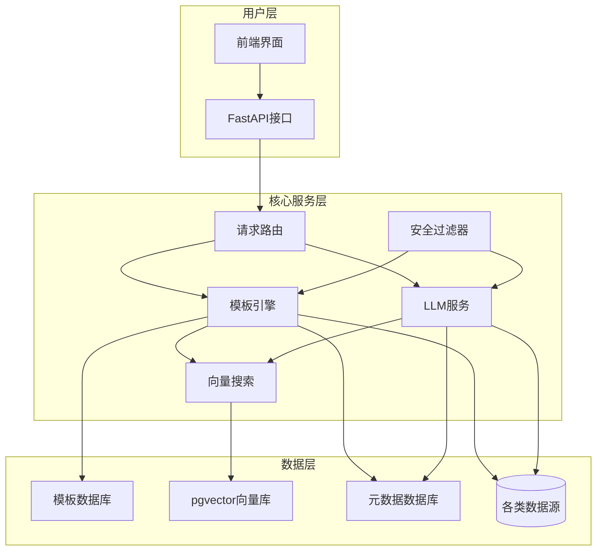
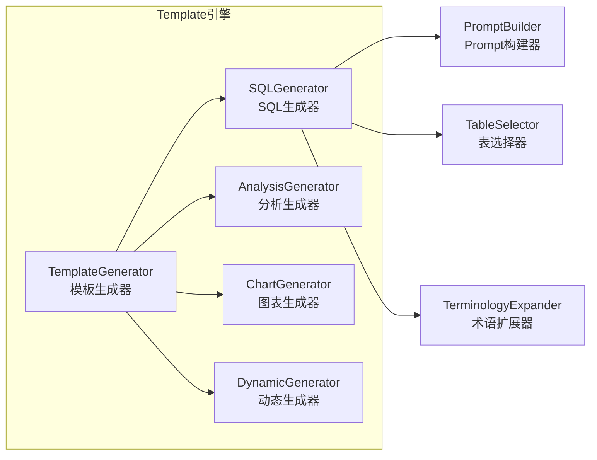
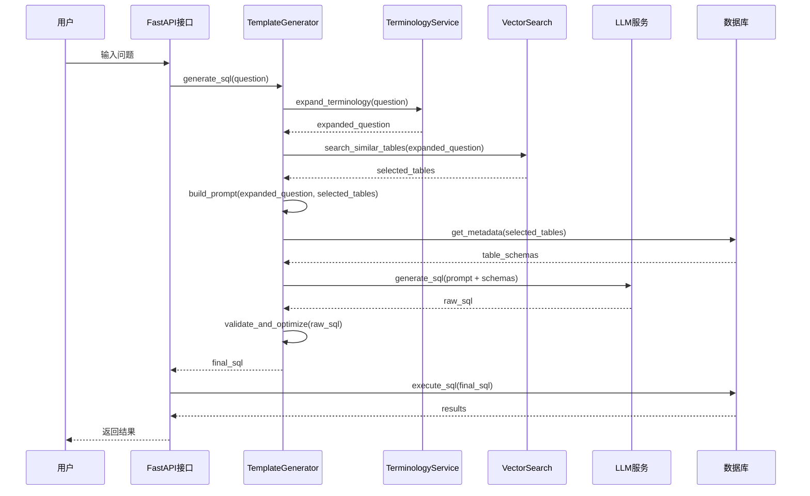
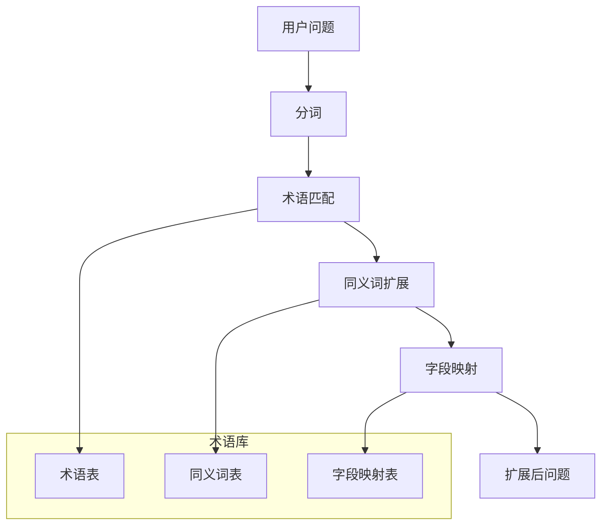

# SQLBot Text2SQL 技术实现文档

## 目录

1. [系统架构概述](#系统架构概述)
2. [核心模块详解](#核心模块详解)
3. [SQL 生成流程](#sql生成流程)
4. [关键算法实现](#关键算法实现)
5. [数据库支持](#数据库支持)
6. [安全机制](#安全机制)
7. [性能优化](#性能优化)

---

## 系统架构概述

### 整体架构

SQLBot 采用**模板驱动 + LLM 生成**的混合架构，结合了传统规则引擎的可靠性和大语言模型的灵活性。



### 核心组件

| 组件                 | 路径                                                                             | 主要职责                        |
| -------------------- | -------------------------------------------------------------------------------- | ------------------------------- |
| **Template 引擎**    | `backend/apps/template/`                                                         | 模板解析、SQL 生成、Prompt 构建 |
| **Datasource 管理**  | `backend/apps/datasource/`                                                       | 数据源连接、元数据获取          |
| **DB 抽象层**        | `backend/apps/db/`                                                               | 多数据库适配、SQL 执行          |
| **Terminology 服务** | `backend/apps/terminology/`                                                      | 术语管理、同义词扩展            |
| **向量搜索**         | `backend/apps/ai_model/embedding.py`, `backend/scripts/regenerate_embeddings.py` | 表/字段向量化、相似度计算       |

---

## 核心模块详解

### 1. Template 引擎模块

Template 引擎是 text2sql 的核心，负责将用户问题转换为 SQL 查询。

#### 1.1 模块结构



### 2. Datasource 管理模块

Datasource 模块负责管理多种数据库连接和元数据获取。

#### 2.1 数据库类型支持

系统支持 11 种数据库类型（定义在 `backend/apps/db/constant.py`）：

```python
class DB(Enum):
    excel = ('excel', 'Excel/CSV', '"', '"', ConnectType.sqlalchemy, 'PostgreSQL')
    redshift = ('redshift', 'AWS Redshift', '"', '"', ConnectType.py_driver, 'AWS_Redshift')
    ck = ('ck', 'ClickHouse', '"', '"', ConnectType.sqlalchemy, 'ClickHouse')
    dm = ('dm', '达梦', '"', '"', ConnectType.py_driver, 'DM')
    doris = ('doris', 'Apache Doris', '`', '`', ConnectType.py_driver, 'Doris')
    es = ('es', 'Elasticsearch', '"', '"', ConnectType.py_driver, 'Elasticsearch')
    kingbase = ('kingbase', 'Kingbase', '"', '"', ConnectType.py_driver, 'Kingbase')
    sqlServer = ('sqlServer', 'Microsoft SQL Server', '[', ']', ConnectType.sqlalchemy, 'Microsoft_SQL_Server')
    mysql = ('mysql', 'MySQL', '`', '`', ConnectType.sqlalchemy, 'MySQL')
    oracle = ('oracle', 'Oracle', '"', '"', ConnectType.sqlalchemy, 'Oracle')
    pg = ('pg', 'PostgreSQL', '"', '"', ConnectType.sqlalchemy, 'PostgreSQL')
    starrocks = ('starrocks', 'StarRocks', '`', '`', ConnectType.py_driver, 'StarRocks')
```

#### 2.2 核心类实现

**函数式模块** (`backend/apps/db/db.py`)

系统采用函数式方法来处理数据库交互，而非文档中最初设计的面向对象抽象类。核心功能由以下函数提供：

- `get_engine(ds: CoreDatasource, timeout: int = 0) -> Engine`: 根据数据源配置创建并返回一个 SQLAlchemy 引擎。
- `get_session(ds: CoreDatasource | AssistantOutDsSchema)`: 基于引擎创建并返回一个数据库会话。
- `check_connection(...)`: 检查与数据源的连接是否正常。
- `exec_sql(...)`: 执行 SQL 查询并返回格式化的结果。

这种方式简化了单次数据库操作的调用，但将数据库特有的逻辑分散在各个函数内部的 `if/else` 判断中。

#### 2.2.2 引擎适配器

**未实现**。

当前代码 **没有采用** 文档中描述的 `DatabaseEngine` 基类和子类适配器模式。不同数据库的方言和连接差异直接在 `db.py` 的函数中通过条件判断来处理，而不是通过多态的引擎适配器对象。

### 3. Terminology 服务模块

Terminology 模块负责管理业务术语和同义词，提升 NL2SQL 的准确性。

#### 3.1 数据模型

**术语模型** (`backend/apps/terminology/models/terminology_model.py`)

```python
class Terminology(SQLModel, table=True):
    __tablename__ = "terminology"
    id: Optional[int] = Field(sa_column=Column(BigInteger, Identity(always=True), primary_key=True))
    oid: Optional[int] = Field(sa_column=Column(BigInteger, nullable=True, default=1))
    pid: Optional[int] = Field(sa_column=Column(BigInteger, nullable=True)) # 父ID，用于实现同义词
    create_time: Optional[datetime] = Field(sa_column=Column(DateTime(timezone=False), nullable=True))
    word: Optional[str] = Field(max_length=255) # 标准术语或同义词
    description: Optional[str] = Field(sa_column=Column(Text, nullable=True))
    embedding: Optional[List[float]] = Field(sa_column=Column(VECTOR(), nullable=True)) # 词向量
    specific_ds: Optional[bool] = Field(sa_column=Column(Boolean, default=False))
    datasource_ids: Optional[list[int]] = Field(sa_column=Column(JSONB), default=[])
```

与原始设计的主要区别：

- 使用 `SQLModel` 进行定义。
- 采用 `pid` (父 ID) 字段来组织同义词，一个父术语可以有多个子术语（同义词），而不是将同义词存储在 JSON 字段中。
- 增加了 `embedding` 字段，用于存储术语的向量表示，以支持基于相似度的搜索。

#### 3.2 核心功能

**术语服务** (`backend/apps/terminology/curd/terminology.py`)

代码中并未实现一个独立的 `TerminologyService` 类，而是通过一系列函数提供服务。

- `select_terminology_by_word(session: SessionDep, word: str, oid: int, datasource: int = None)`: 这是核心的术语扩展函数。它结合了 **关键字匹配** 和 **向量相似度搜索** 两种方式来查找与用户问题相关的术语及其同义词。
- `get_terminology_template(...)`: 基于 `select_terminology_by_word` 的结果，生成用于构建 Prompt 的 XML 格式术语提示。
- `run_save_terminology_embeddings(...)`: 异步任务，用于计算并存储术语的向量。

这种实现方式将术语扩展的逻辑与 Prompt 生成紧密耦合，并利用向量技术提高了匹配的准确性。

### 4. 向量搜索模块

向量搜索模块使用 pgvector 存储和检索表/字段的向量表示。

#### 4.1 向量存储结构

**表向量表** (Alembic migration `047_table_embedding.py`)

```python
class TableEmbedding(Base):
    """表向量存储"""
    __tablename__ = "table_embedding"

    id = Column(Integer, primary_key=True)
    table_name = Column(String(200), nullable=False)
    table_comment = Column(Text)
    column_info = Column(JSON)  # 字段信息
    embedding = Column(Vector(384))  # 384维向量
    datasource_id = Column(Integer)
    oid = Column(String(50))
```

#### 4.2 向量生成和搜索

**向量服务** (`backend/scripts/regenerate_embeddings.py`)

```python
class VectorSearch:
    """
    向量搜索服务，基于text2vec-base-chinese模型
    """

    def __init__(self):
        self.model = SentenceModel("backend/text2vec-base-chinese")

    async def generate_table_embedding(self, table_info: Dict) -> List[float]:
        """
        生成表的向量表示
        输入: 表名、注释、字段信息
        输出: 384维向量
        """
        text = self._build_table_text(table_info)
        embedding = self.model.encode(text)
        return embedding.tolist()

    async def search_similar_tables(self, question: str, top_k: int = 10) -> List[Dict]:
        """
        搜索与问题最相关的表
        返回: [{"table_name": str, "similarity": float}]
        """
        question_embedding = self.model.encode(question)

        # 使用pgvector的余弦相似度搜索
        sql = """
        SELECT table_name, 1 - (embedding <=> :embedding) as similarity
        FROM table_embedding
        WHERE datasource_id = :datasource_id
        ORDER BY embedding <=> :embedding
        LIMIT :top_k
        """

        results = await db.execute(sql, {
            "embedding": question_embedding.tolist(),
            "datasource_id": self.datasource_id,
            "top_k": top_k
        })

        return results
```

---

## SQL 生成流程

### 完整流程图



### 详细步骤说明

#### 步骤 1：术语扩展

**输入**：用户原始问题
**处理**：识别问题中的业务术语并扩展同义词
**输出**：扩展后的问题

```python
# 示例
原始问题: "查询上个月的销售额"
扩展后: "查询上个月的销售额(销售金额、营业收入、营收)"
```

**关键代码** (`backend/apps/terminology/curd/terminology.py`)

```python
def get_terminology_template(session: SessionDep, question: str, oid: Optional[int] = 1,
                             datasource: Optional[int] = None) -> str:
    if not oid:
        oid = 1
    _results = select_terminology_by_word(session, question, oid, datasource)
    if _results and len(_results) > 0:
        terminology = to_xml_string(_results)
        template = get_base_terminology_template().format(terminologies=terminology)
        return template
    else:
        return ''
```

#### 步骤 2：表选择

**输入**：扩展后的问题
**处理**：使用向量搜索找到最相关的表
**输出**：选中的表列表（带相似度分数）

**实现说明** (`apps/datasource/embedding/table_embedding.py`):

此功能由 `calc_table_embedding` 函数实现，它负责在线计算用户问题与预存表向量之间的相似度。

```python
# 位于 apps/datasource/embedding/table_embedding.py
def calc_table_embedding(tables: list[dict], question: str):
    # ...
    # 从 EmbeddingModelCache 获取模型
    model = EmbeddingModelCache.get_model()

    # 为用户问题生成查询向量
    q_embedding = model.embed_query(question)

    for item in _list:
        # 加载存储的表向量
        stored_embedding = json.loads(item.get('embedding'))

        # 计算余弦相似度
        item['cosine_similarity'] = cosine_similarity(q_embedding, stored_embedding)

    # 按相似度降序排序并截取前 N 个
    _list.sort(key=lambda x: x['cosine_similarity'], reverse=True)
    _list = _list[:settings.TABLE_EMBEDDING_COUNT]
    return _list
```

**逻辑解析**:

1.  **获取模型**: 从 `EmbeddingModelCache` 获取全局唯一的 embedding 模型实例。
2.  **生成查询向量**: 将用户的 `question` 转换为查询向量。
3.  **循环计算**: 遍历所有候选表，加载它们预先计算并以 JSON 字符串形式存储的向量。
4.  **余弦相似度**: 调用 `common.utils.cosine_similarity` 工具函数计算查询向量与每个表向量的相似度。
5.  **排序筛选**: 根据相似度分数对表进行降序排序，并返回分数最高的 `settings.TABLE_EMBEDDING_COUNT` 个表作为最终选择。

这个过程是纯粹的向量相似度搜索，在运行时动态执行，确保了对用户问题的实时响应。

#### 步骤 3：Prompt 构建

**输入**：扩展问题 + 选中表
**处理**：构建 LLM 的 Prompt
**输出**：结构化 Prompt

**实现说明**:

`apps/template/generate_sql/generator.py` 文件为空，但完整的、针对 SQL 生成的动态 Prompt 构建逻辑分布在不同的模块中，在最终调用 LLM 前组合而成。核心的模板构建逻辑位于 `apps/template/template.py` 和 `apps/template/generate_chart/generator.py`。

- **`apps/template/template.py`**: 定义了基础的 Prompt 模板框架。
- **`apps/template/generate_chart/generator.py`**: 包含了构建图表相关的 Prompt 逻辑。
- **`apps/terminology/curd/terminology.py`**: `get_terminology_template` 函数负责生成术语相关的 XML 提示片段。

最终的 Prompt 是在调用 LLM 服务之前，通过字符串拼接的方式，将基础模板、术语模板、表结构信息和用户问题动态地组合在一起。

#### 步骤 4：LLM 生成

**输入**：Prompt
**处理**：调用 LLM 服务生成 SQL
**输出**：原始 SQL

**实现说明**:

代码库中 `apps/ai_model/llm.py` 文件当前为空，表明直接的 LLM 调用逻辑尚未在该模块中实现。

然而，`apps/system/crud/assistant.py` 模块揭示了系统与外部 LLM 服务（或作为 LLM 代理的数据平台）的交互方式。该模块主要负责处理“外部数据源助手”的配置、认证和数据获取。

- **`AssistantOutDs` 类**: 这个类是与外部服务交互的核心。它通过 HTTP 请求从配置的 `endpoint` 获取数据源列表和 schema 信息。
- **认证处理**: 在 `get_ds_from_api` 方法中，它会根据配置，将认证信息（如 API Key）添加到请求的 `header`, `cookie`, 或 `param` 中。
- **数据获取**: 它负责调用外部接口，获取数据源列表 (`get_simple_ds_list`) 和单个数据源的详细 schema (`get_db_schema`)。

这表明，对于配置为使用外部助手的场景，SQLBot 并不直接调用 OpenAI 等基础 LLM，而是将构建好的 Prompt 和上下文信息发送到一个中间服务，由该服务完成最终的 LLM 调用和 SQL 生成。直接调用基础 LLM 的逻辑可能存在于其他未被发现的模块中，或者仅用于非外部助手的场景。

#### 步骤 5：SQL 验证和优化

**输入**：原始 SQL
**处理**:

1.  语法验证
2.  安全性检查（防止注入）
3.  添加 LIMIT 限制

**实现说明**:

在当前分析的代码库中，**未找到** 文档中所描述的结构化 SQL 验证和优化模块（如 `_validate_sql` 函数、`SQLInjectionFilter` 或 `SafeSQLExecutor` 类）。

SQL 的执行由 `apps/db/db.py` 中的 `exec_sql` 函数处理。从代码来看，该函数：

- 会移除 SQL 语句末尾的多余分号。
- 直接将 SQL 语句传递给数据库驱动执行。

这意味着系统的安全性和验证主要依赖于：

1.  **参数化查询**: 在 SQLAlchemy 和其他数据库驱动的常规使用中，可以防止 SQL 注入（但这部分在 `exec_sql` 中并未显式使用，它接收的是完整的 SQL 字符串）。
2.  **数据库自身的权限控制**: 数据库用户的权限限制了可执行的操作。
3.  **Prompt 工程**: 通过在 Prompt 中指导 LLM 生成安全、有效的 SQL。

代码中没有发现显式的、用于在执行前解析和重写 SQL 的安全过滤层或优化层。LIMIT 限制等逻辑可能是在构建 Prompt 时直接要求 LLM 添加的，而不是在后端进行后处理。

---

## 关键算法实现

### 1. 表选择算法

表选择是 text2sql 的关键步骤，直接影响 SQL 生成的准确性。

#### 算法原理

基于**余弦相似度**的向量搜索算法：

1. **向量表示**：将表信息和用户问题转换为向量
2. **相似度计算**：`similarity = cos(θ) = (A·B) / (||A|| × ||B||)`
3. **阈值过滤**：过滤低相似度的表
4. **回退机制**：无匹配时返回所有表

#### 向量生成策略

**表信息文本构建** (`apps/datasource/crud/table.py`)

在 `save_table_embedding` 函数中，系统通过以下方式构建用于生成向量的文本描述。这部分代码是实际的实现，取代了文档中原有的 `_build_table_text` 示例。

```python
# 位于 apps/datasource/crud/table.py 的 save_table_embedding 函数中
# ...
for _id in ids:
    table = session.query(CoreTable).filter(CoreTable.id == _id).first()
    fields = session.query(CoreField).filter(CoreField.table_id == table.id).all()

    schema_table = ''
    schema_table += f"# Table: {table.table_name}"
    table_comment = ''
    if table.custom_comment:
        table_comment = table.custom_comment.strip()
    if table_comment == '':
        schema_table += '\\n[\\n'
    else:
        schema_table += f", {table_comment}\\n[\\n"

    if fields:
        field_list = []
        for field in fields:
            field_comment = ''
            if field.custom_comment:
                field_comment = field.custom_comment.strip()
            if field_comment == '':
                field_list.append(f"({field.field_name}:{field.field_type})")
            else:
                field_list.append(f"({field.field_name}:{field.field_type}, {field_comment})")
        schema_table += ",\\n".join(field_list)
    schema_table += '\\n]\\n'

    # 使用模型为构建好的 schema_table 文本生成 embedding
    emb = json.dumps(model.embed_query(schema_table))
    # ... 将 emb 存入数据库
```

**逻辑解析**:

1.  **表名优先**: 文本以 `# Table: {table.table_name}` 开始。
2.  **拼接注释**: 如果表有自定义注释 (`custom_comment`)，则附加在表名后。
3.  **字段信息**: 遍历所有字段，将每个字段的 `(字段名:字段类型)` 或 `(字段名:字段类型, 字段注释)` 拼接起来。
4.  **格式化**: 整个结构被格式化成一个类似 Markdown 的文本块，然后送入 embedding 模型进行向量化。

这个过程在 `scripts/regenerate_embeddings.py` 脚本被调用时执行，用于预先计算并存储所有表的向量。

#### 相似度计算

**在线相似度计算** (`apps/datasource/embedding/table_embedding.py`)

在 `calc_table_embedding` 函数中，系统执行在线的相似度计算来为用户问题选择最相关的表。此实现取代了文档中设计的混合相似度算法。

```python
# 位于 apps/datasource/embedding/table_embedding.py 的 calc_table_embedding 函数中
def calc_table_embedding(tables: list[dict], question: str):
    # ...
    try:
        # 从 EmbeddingModelCache 获取模型
        model = EmbeddingModelCache.get_model()

        # 从传入的 tables 列表中获取预计算好的 embedding
        results = [item.get('embedding') for item in _list]

        # 为用户问题生成查询向量
        q_embedding = model.embed_query(question)
        q_embedding_dim = len(q_embedding)

        for index in range(len(results)):
            item = results[index]
            if item:
                try:
                    # 加载存储的表向量
                    stored_embedding = json.loads(item)
                    stored_dim = len(stored_embedding)

                    # 检查向量维度是否匹配
                    if stored_dim != q_embedding_dim:
                        # 记录警告并跳过
                        _list[index]['cosine_similarity'] = 0.0
                        continue

                    # 计算余弦相似度
                    _list[index]['cosine_similarity'] = cosine_similarity(q_embedding, stored_embedding)
                except (json.JSONDecodeError, ValueError) as e:
                    # 处理异常
                    _list[index]['cosine_similarity'] = 0.0

        # 按相似度降序排序并截取前 N 个
        _list.sort(key=lambda x: x['cosine_similarity'], reverse=True)
        _list = _list[:settings.TABLE_EMBEDDING_COUNT]
        return _list
    # ...
```

**逻辑解析**:

1.  **获取模型和数据**: 从缓存中获取 embedding 模型，并从传入的 `tables` 列表中提取预先计算好的向量。
2.  **生成查询向量**: 使用模型将用户的 `question` 转换为查询向量 `q_embedding`。
3.  **维度检查**: 在计算相似度之前，会检查存储的表向量维度和查询向量维度是否一致，如果不一致则跳过，避免出错。
4.  **余弦相似度**: 调用 `cosine_similarity` 工具函数计算查询向量与每个表向量之间的余弦相似度。
5.  **排序和筛选**: 根据计算出的相似度分数对表进行降序排序，并返回分数最高的 `TABLE_EMBEDDING_COUNT` 个表。

这个过程是 **纯向量相似度搜索**，并未包含文档中设计的关键词匹配等混合策略。

### 2. 术语扩展算法

术语扩展将业务术语转换为数据库字段名，提升匹配准确率。

#### 算法流程



#### 实现细节

**术语匹配与模板生成** (`apps/terminology/curd/terminology.py`)

代码库中并未实现一个独立的、通用的 `expand_question` 函数，而是通过 `select_terminology_by_word` 和 `get_terminology_template` 两个函数协同工作，实现了术语的查找和模板生成。

1.  **`select_terminology_by_word`**: 这是术语查找的核心。它接收用户问题（`word`），并结合 **关键字精确匹配** 和 **向量相似度搜索** 来查找相关的术语及其同义词。

    - 它会先尝试精确匹配。
    - 然后，它会利用存储在 `terminology` 表中的 `embedding` 字段，执行向量搜索，找出语义上相似的术语。
    - 最后，它会合并结果，并利用 `pid` 字段找到所有相关的同义词。

2.  **`get_terminology_template`**: 此函数调用 `select_terminology_by_word` 获取术语列表，然后使用 `to_xml_string` 将结果格式化为一个 XML 字符串。这个 XML 块最终会被插入到发送给 LLM 的 Prompt 中，作为上下文提示。

```python
# 位于 apps/terminology/curd/terminology.py
def get_terminology_template(session: SessionDep, question: str, oid: Optional[int] = 1,
                             datasource: Optional[int] = None) -> str:
    if not oid:
        oid = 1
    # 1. 查找术语（混合关键字与向量搜索）
    _results = select_terminology_by_word(session, question, oid, datasource)
    if _results and len(_results) > 0:
        # 2. 将结果转换为 XML 格式
        terminology = to_xml_string(_results)
        # 3. 插入到基础模板中
        template = get_base_terminology_template().format(terminologies=terminology)
        return template
    else:
        return ''
```

这种方式将术语扩展的逻辑与 Prompt 的构建紧密地结合在了一起。

#### 性能优化

**实现说明**：
文档中描述的 `TerminologyCache` 类在代码库中未找到明确实现。术语相关的缓存可能依赖于 FastAPI 的通用缓存工具（如 `fastapi-cache2`，如果已集成）或外部缓存服务（如 Redis），但代码库中没有专门为此功能设计的独立缓存类。术语的获取目前是直接从数据库中查询。

### 3. Prompt 构建算法

**实际实现**

代码库中并未包含一个如文档设计的、功能完备的 `_build_structured_prompt` 或 `PromptOptimizer` 类。实际的 Prompt 构建过程更为直接和分散，主要依赖于 `apps/template/` 目录下的多个模块，在最终调用 LLM 之前，通过字符串拼接的方式动态组合而成。

**核心流程**：

1.  **基础模板**: `apps/template/template.py` 中定义了各种场景的基础 Prompt 模板（如 `get_base_template`）。
2.  **术语模板**: `apps/terminology/curd/terminology.py` 中的 `get_terminology_template` 函数会生成一个包含相关术语和同义词的 XML 片段。
3.  **表结构信息**: 在选择了相关表之后，代码会动态生成这些表的 `CREATE TABLE` 语句或类似的结构化描述。
4.  **组合**: 在发起 LLM 请求之前，代码会将 **基础模板**、**术语模板 XML**、**表结构信息** 以及用户的 **问题** 拼接在一起，形成最终的 Prompt。

这种方式虽然没有文档中设计得那么结构化和可优化，但足够灵活，能够将所有必要的信息提供给 LLM。

---

## 数据库支持

### 支持的 11 种数据库

SQLBot 通过 `backend/apps/db/db.py` 中的函数式模块来支持多种数据库，而不是通过文档中描绘的适配器类架构。

#### 数据库适配器架构

**实现说明**：
下图展示的设计（一个统一的 `DB` 类和为每种数据库设计的 `Engine` 子类适配器）**并未在代码中实现**。实际的数据库操作由 `db.py` 中的 `get_engine`、`exec_sql` 等函数处理，内部通过 `if/else` 判断来处理不同数据库的方言差异。

```mermaid
graph TD
    subgraph 理想设计（未实现）
        DB[DB类<br/>统一接口]

        DB --> MySQL[MySQLEngine]
        DB --> PG[PostgreSQLEngine]
        DB --> Oracle[OracleEngine]
        DB --> SQLServer[SQLServerEngine]
        DB --> CH[ClickHouseEngine]
        DB --> Doris[DorisEngine]
        DB --> ES[ElasticsearchEngine]
        DB --> Hive[HiveEngine]
        DB --> Spark[SparkEngine]
        DB --> Kingbase[KingbaseEngine]
        DB --> DM[DMEngine]

        MySQL --> MySQLConn[mysql-connector]
        PG --> PGConn[psycopg2]
        Oracle --> OracleConn[cx_Oracle]
        SQLServer --> SQLServerConn[pymssql]
        CH --> CHConn[clickhouse-driver]
        Doris --> DorisConn[pymysql]
        ES --> ESConn[elasticsearch-py]
        Hive --> HiveConn[pyhive]
        Spark --> SparkConn[pyspark]
        Kingbase --> KingbaseConn[ksycopg2]
        DM --> DMConn[dmPython]
    end
```

---

## 安全机制

### 1. SQL 注入防护

多层防护机制确保 SQL 注入安全。

#### 1.1 输入验证

**实现说明**：
文档中描述的 `SQLInjectionFilter` 类和 `_clean_llm_output` 等函数在 `backend/apps/template/filter/generator.py` 中并未找到。

经过对 `apps/db/db.py` 的分析，安全相关的逻辑主要体现在 `exec_sql` 函数中，但其实现非常基础：

- **移除末尾分号**: `while sql.endswith(';'): sql = sql[:-1]`，这是一个简单的规范化步骤，并非核心安全措施。
- **直接执行**: 该函数接收一个完整的 SQL 字符串，并使用 `session.execute(text(sql))` 来执行。这种方式本身 **不提供** 类似参数化查询的 SQL 注入防护。

因此，系统的 SQL 注入防护主要依赖于以下几点，而不是一个显式的过滤层：

1.  **上游控制**: 期望调用者（如 LLM 的输出）已经生成了“干净”的 SQL。
2.  **数据库权限**: 运行查询的数据库用户权限被严格限制，以减小潜在攻击的影响范围。
3.  **Prompt 设计**: 在 Prompt 中明确指示 LLM 不要生成有害或修改性的 SQL 语句。

代码中 **没有** 发现主动解析、验证或清理 LLM 输出的 SQL 的安全过滤器。

#### 1.3 执行安全

**实现说明**：
文档中描述的 `SafeSQLExecutor` 类在 `backend/apps/db/db.py` 中未找到。SQL 执行的安全限制，如超时控制和结果行数限制，是在 `exec_sql` 函数中通过其参数和数据库驱动的特性来间接处理的，而不是通过一个专门的安全执行器类。

- **超时控制**: `exec_sql` 函数本身不直接接受超时参数，但它调用的 `get_session` -> `get_engine` 流程中，`create_engine` 和各种原生连接器（如 `pymssql.connect`）都设置了 `timeout` 或 `connect_timeout` 参数。这主要控制连接和池等待的超时，而不是单次查询的执行超时。
- **结果行数限制**: `exec_sql` 函数在获取结果后，并没有显式的行数限制逻辑。限制返回数据量的责任落在了生成 SQL 的上游（即 LLM），需要在 Prompt 中明确指示其添加 `LIMIT` 子句。

因此，执行安全主要依赖于数据库连接配置和 Prompt 工程，而非一个独立的后端安全执行模块。

### 2. 权限控制

**实现说明**：
文档中详细描述的 `RowPermissionFilter` 和 `ColumnPermissionFilter` 类在代码库中 **均未找到**。然而，Alembic 迁移脚本（如 `026_row_column_permission.py`）表明系统中确实存在行和列级别的权限概念。这些权限控制逻辑很可能直接实现在数据查询的 CRUD 操作中，通过在构建 SQL 查询时动态添加 `WHERE` 条件或过滤字段来实现，而不是通过文档中设计的独立过滤类。

### 3. 审计日志

**审计模型** (`backend/alembic/versions/037_create_chat_log.py`)

`chat_log` 表的结构与文档有较大出入，实际字段更丰富，包含了 `type` 和 `operate` 等枚举字段，用于区分不同的日志类型和操作。

```python
def upgrade():
    op.create_table('chat_log',
    sa.Column('id', sa.BigInteger(), sa.Identity(always=True), nullable=False),
    sa.Column('type', sa.Enum('0', name='typeenum', native_enum=False, length=3), nullable=True),
    sa.Column('operate', sa.Enum('0', '1', '2', '3', '4', '5', '6', name='operationenum', native_enum=False, length=3), nullable=True),
    sa.Column('pid', sa.BigInteger(), nullable=True),
    sa.Column('ai_modal_id', sa.BigInteger(), nullable=True),
    # ... 其他字段
    sa.PrimaryKeyConstraint('id')
    )
```

**审计服务**

**部分实现**。代码库中不存在 `apps/system/crud/chat_log.py` 文件，因此文档描述的 `AuditService` 类未被实现。

然而，审计日志的记录逻辑分散在 `apps/chat/curd/chat.py` 文件中，通过以下函数实现：

- **`start_log(...)`**: 在操作开始时调用，用于创建一个新的 `ChatLog` 记录，并将其存入数据库。它记录了操作类型、关联的记录 ID、AI 模型信息以及完整的输入消息。

- **`end_log(...)`**: 在操作完成时调用，用于更新 `start_log` 创建的日志记录。它会补充操作的完成时间、最终的 token 使用量以及 LLM 的思考过程（`reasoning_content`）。

这种实现方式将日志记录与核心的聊天业务逻辑紧密耦合在一起，而不是通过一个独立的、可复用的审计服务。每次需要记录日志时，都需要显式调用这两个函数。

---

## 性能优化

### 1. 向量搜索优化

#### 1.1 索引优化

**pgvector 索引** (`backend/alembic/versions/047_table_embedding.py`)

```python
def upgrade():
    # 创建向量索引
    op.execute("""
        CREATE INDEX idx_table_embedding_vector
        ON table_embedding
        USING ivfflat (embedding vector_cosine_ops)
        WITH (lists = 100)
    """)

    # 创建复合索引
    op.create_index(
        'idx_table_embedding_datasource',
        'table_embedding',
        ['datasource_id', 'oid']
    )
```

**索引策略**：

- **IVFFlat 索引**：加速向量相似度搜索

  - `lists = 100`：根据数据量调整
  - 适合：高维向量（384 维）
  - 查询时探索：`probes = 10`

- **复合索引**：加速 datasource 过滤
  - 先过滤 datasource，再向量搜索
  - 减少搜索空间

#### 1.2 缓存策略

**实现** (`apps/ai_model/embedding.py`)

代码中通过 `EmbeddingModelCache` 类实现了对 Embedding 模型的缓存，确保在应用生命周期内模型只被加载一次，避免了重复加载带来的性能开销。

```python
# 位于 apps/ai_model/embedding.py
class EmbeddingModelCache:
    _model = None
    _model_name = None
    _lock = threading.Lock()

    @classmethod
    def get_model(cls):
        with cls._lock:
            model_name = settings.DEFAULT_EMBEDDING_MODEL
            if cls._model is None or cls._model_name != model_name:
                SQLBotLogUtil.info(f"加载 embedding 模型: {model_name}")
                cls._model_name = model_name
                cls._model = SentenceTransformer(model_name)
            return cls._model
```

**逻辑解析**:

- **单例模式**: 使用类变量 `_model` 和 `_model_name` 来存储加载的模型实例和名称。
- **线程安全**: 使用 `threading.Lock()` 来保证在多线程环境下模型加载过程的原子性，防止多个线程同时尝试加载模型。
- **按需加载/更新**: 只有在模型未加载或 `DEFAULT_EMBEDDING_MODEL` 配置发生变化时，才会执行加载操作。

然而，对于向量本身（即表的 embedding 数据），代码中并未发现如文档设计的 `VectorCache` 或 `CacheWarmer` 等应用层缓存机制。向量数据直接从数据库中读取。

### 2. Prompt 缓存

**实现说明**：
代码库中未发现针对 Prompt 的特定缓存机制，如 `PromptCache` 或 `SimilarPromptMatcher`。每次请求都会根据上下文动态生成新的 Prompt。

### 3. 连接池优化

**数据库连接池** (`backend/apps/db/db.py`)

**部分实现**。

代码在 `get_engine` 函数中通过 `sqlalchemy.create_engine` 创建数据库引擎时，**确实利用了 SQLAlchemy 内置的连接池功能**。虽然没有像文档中那样显式定义一个 `ConnectionPool` 类来封装所有配置，但 `create_engine` 函数本身就管理着一个连接池。可以通过 `pool_size`, `max_overflow`, `pool_recycle` 等参数来配置连接池的行为。

```python
# backend/apps/db/db.py 中的示例片段
def get_engine(ds: CoreDatasource, timeout: int = 0) -> Engine:
    # ...
    if equals_ignore_case(ds.type, "pg"):
        # ...
        engine = create_engine(get_uri(ds),
                               connect_args={"options": f"-c search_path={...}", "connect_timeout": conf.timeout},
                               pool_timeout=conf.timeout) # pool_timeout 影响连接池获取连接的超时
    # ...
    return engine
```

这种实现方式依赖于 SQLAlchemy 的默认行为，而不是一个自定义的、可集中管理的连接池封装类。

**连接池监控**：

**实现说明**：
文档中描述的 `ConnectionPoolMonitor` 类及其自动调整连接池大小的功能在代码库中未找到明确实现。

### 4. 异步处理

**实现说明**：
尽管 FastAPI 是一个异步框架，但代码库中的核心数据处理和 AI 计算逻辑（如 `save_table_embedding`, `calc_table_embedding`）主要是以同步方式执行的。文档中设想的 `AsyncSQLGenerator` 和 `AsyncVectorSearch` 等高级异步并发优化类（使用 `asyncio.Semaphore`, `run_in_executor` 等）并未在当前代码中实现。

性能优化主要依赖于：

- FastAPI 的异步 I/O 处理 Web 请求。
- SQLAlchemy 的内置连接池管理数据库连接。
- 通过 `regenerate_embeddings.py` 脚本预计算向量，避免在线实时计算。

---
